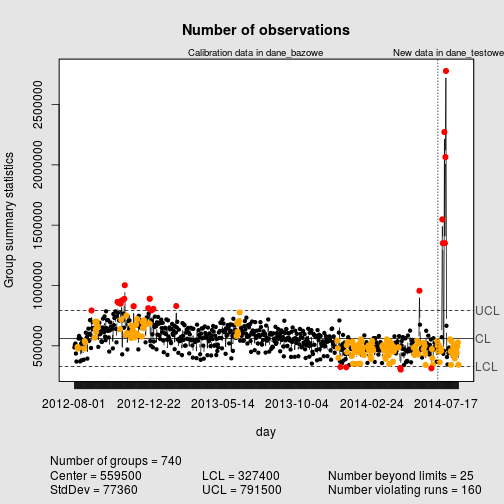

## Quality Control and quality assurance
 1. Very important in multiple (if not all) industries
 2. For most, this means that one or more people are meticulously inspecting what's coming out
 3. Looking for imperfections and validating that requirements for products and services produced are satisfied. 
 
## Enter statistical quality control

 1. Statistical process control (SPC) is a method of quality control which uses statistical methods. (http://en.wikipedia.org/wiki/Statistical_process_control)
 2. Especially a Shewhart individuals control chart

---

## Basic tools for working with qcc
 

```r
library(qcc) # for creating qcc plots
```

```
## Package 'qcc', version 2.5
## Type 'citation("qcc")' for citing this R package in publications.
```

```r
library(xts) # for creating and working with time series
```

```
## Loading required package: zoo
## 
## Attaching package: 'zoo'
## 
## The following objects are masked from 'package:base':
## 
##     as.Date, as.Date.numeric
```

```r
library(lubridate) # for parsing strings to dates
```

---

## QCC Shiny app

* App was created to be a demo of QCC abilities in R.
* It contains predefined set of observation spanning two years
* It displays a quality check and control plot
* Range of dates can be used to manipulate the chart
* Each time the date change (being range for base (reference) data or for new data) plot will update

## Apps avaliable at:
# http://czyzu.shinyapps.io/DevDataProd_Project

---

## Sample plot


```r
qcc (data=dane_bazowe, newdata=dane_testowe, 
     type="xbar.one", title="Number of observations", xlab="day")
```



```
## List of 15
##  $ call        : language qcc(data = dane_bazowe, type = "xbar.one", newdata = dane_testowe,      title = "Number of observations", xlab = "day")
##  $ type        : chr "xbar.one"
##  $ data.name   : chr "dane_bazowe"
##  $ data        : int [1:700, 1] 486975 508788 519119 436171 369792 490799 490547 478138 560497 581914 ...
##   ..- attr(*, "dimnames")=List of 2
##  $ statistics  : Named int [1:700] 486975 508788 519119 436171 369792 490799 490547 478138 560497 581914 ...
##   ..- attr(*, "names")= chr [1:700] "2012-08-01" "2012-08-02" "2012-08-03" "2012-08-04" ...
##  $ sizes       : Named int [1:700] 1 1 1 1 1 1 1 1 1 1 ...
##   ..- attr(*, "names")= chr [1:700] "2012-08-01" "2012-08-02" "2012-08-03" "2012-08-04" ...
##  $ center      : num 559458
##  $ std.dev     : num 77361
##  $ newstats    : Named int [1:40] 450028 508668 465635 364135 470571 480241 457537 571840 1548212 1351203 ...
##   ..- attr(*, "names")= chr [1:40] "2014-07-02" "2014-07-03" "2014-07-04" "2014-07-05" ...
##  $ newdata     : int [1:40, 1] 450028 508668 465635 364135 470571 480241 457537 571840 1548212 1351203 ...
##   ..- attr(*, "dimnames")=List of 2
##  $ newsizes    : Named int [1:40] 1 1 1 1 1 1 1 1 1 1 ...
##   ..- attr(*, "names")= chr [1:40] "2014-07-02" "2014-07-03" "2014-07-04" "2014-07-05" ...
##  $ newdata.name: chr "dane_testowe"
##  $ nsigmas     : num 3
##  $ limits      : num [1, 1:2] 327374 791541
##   ..- attr(*, "dimnames")=List of 2
##  $ violations  :List of 2
##  - attr(*, "class")= chr "qcc"
```

